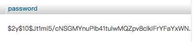

# Code Review Report

Table of Contents
  
- [Code Review Report](#code-review-report)
- [Introdcution](#introdcution)
- [Code Quality Review](#code-quality-review)
  - [Code Formatting](#code-formatting)
  - [Architecture](#architecture)
  - [Coding best practices](#coding-best-practices)
    - [No hardcoding](#no-hardcoding)
    - [Comments](#comments)
    - [Avoid multiple if/else blocks](#avoid-multiple-ifelse-blocks)
  - [Non Functional requirements](#non-functional-requirements)
    - [Maintainability](#maintainability)
    - [Reusability](#reusability)
    - [Reliability](#reliability)
    - [Extensibility](#extensibility)
    - [Security](#security)
    - [Scalability](#scalability)
    - [Usability](#usability)
  - [Object-Oriented Analysis and Design (OOAD) Principles](#object-oriented-analysis-and-design-ooad-principles)


# Introdcution
&nbsp;&nbsp; This code quality report is created after the first MVP is done. The purpose of this document is to imporve the qulity of our code and it is very essential for the success of coding projects and has enableed us to become a more skilled developer.
There are some reasons for why we find that code review to be essential for a coding project.
- Consistent design and development
- Improve the code quility and performance
- Minimize the mistakes and its impact
- Meetting the requirement
# Code Quality Review
## Code Formatting
* Alignment<br/> 
  When we are coding ,we installed some formatters in Vscode, so we can make sure that our alignment is keeping consistent through all files including HTML/CSS/JS/PHP.
* Naming Conventions<br/>
  ALL the names through our files are use Pascal and CamelCase.

Pascal Example:
``` php
$data = [
            "short_name" => $row['short_name'],
            "title" => $row["title"],
            "faculty" => $row["faculty"],
            "course_num" => $row["course_num"],
            "credit" => $row["credit"],
            "description" => $row["description"],
            "prerequisite" => $row["prerequisite"],
            "preExpression" => $row["preExpression"],
            "preExpression_v2" => $row["preExpression_v2"],
        ];
```
CamelCase Example:
```php
$doneList = isset($_REQUEST["doneList"])? json_decode($_REQUEST["doneList"], true): '';
$major = isset($_REQUEST["major"]) ? $_REQUEST["major"] : '';
$maxNum = isset($_REQUEST["maxNum"]) ? $_REQUEST["maxNum"] : '';
$totalCredit = isset($_REQUEST["totalCredit"]) ? $_REQUEST["totalCredit"] : '';
```
* Code Views<br/>
  After browsering all files in a 13 inch laptop, we believe our code should fit in the standard 14 inch screen. There are no need to scroll horizontally to view our code. 
## Architecture


<pre>
.Code
├── Controller
├── css
├── html
├── img
├── js
├── JSON
├── model
├── Python
├── RestPHP
├── View
├── academicBuilder_Builder.php
├── academicBuilder_Default.php
├── academicBuilder_Main.php
├── Api.php
├── courseDB.php
├── homePage.php
├── login.php
├── reset-password.php
├── semesterBuilder_v2.php
├── semesterBuilder.php
└── signup.php
</pre>


All the code is spilt into different directory accounding to their format and purpose.For example,all style files are under <mark>/css</mark>, all back-end database-required file are under <mark>/model</mark>.
For example:


All the code is spilt into different directory accounding to their format and purpose.For example,all style files are under <mark>/css</mark>, all back-end database-required file are under <mark>/model</mark>.
For example:

<pre>
.css
├── academicBuilder_Customize.css
├── academicBuilder_Default.css
├── academicBuilder_main.css
├── academicBuilder.css
├── academicBuilderCompleteCourseTable.css
├── academicBuilderNCDetail.css
├── academicBuilderTermDetail.css
├── canlendar.css
├── courseDB.css
├── homePage.css
├── logIn-signUp.css
├── main.css
└── semester.css
</pre>
<pre>
.model
├── allcourse.php
├── course_db_config.php
├── course.php
├── courseREC_v2.php
├── courseREC.php
├── courseRegStatus_v2.php
├── courseRegStatus.php
├── logout.php
├── section.php
├── sign_in.php
├── takenClass.php
├── test.php
└── vsbp_db_config.php
</pre>
Some important components explain:
* <mark>/controller</mark><br/>
  Controller is used to map data form database, so we are able to change database from one client to another easily.
*  <mark>/model</mark><br/>
  Obtain data from database.
  for example:
  ```php
  define('DB_SERVER', '127.0.0.1');
define('DB_USERNAME', 'root');
define('DB_PASSWORD', 'vsbp');
define('DB_NAME', 'course');

/* Attempt to connect to MySQL database */
$conn = mysqli_connect(DB_SERVER, DB_USERNAME, DB_PASSWORD, DB_NAME);

// Check connection
if ($conn === false) {
    die("ERROR! Connection FAILED: " . mysqli_connect_error());
} else {
    $conn_message =
        "<script>
    console.log( 'DB_SERVER: " .
        DB_SERVER .
        "');
    console.log( 'DB_NAME: " .
        DB_NAME .
        "');
    </script>";
    //echo $conn_message;
}
  ```
*  <mark>/JSON</mark><br/>
  Store the data form database.
 *  <mark>/js</mark><br/>
  It contians all the front-end javascript file.All needed data are gathered in <mark>/JSON</mark> and <mark>/model</mark>, so it can be directly used in js file.
  for example:
  ```javaScript
  function fetchCourseJSON(sid, password) {
    $.post('Model/takenClass.php', {
        sid: sid,
        password: password
    }, function (data) {
        btnForCourse(data);
        showCourses(data);
        getCreditsEarned(data);
        storePassedCourse(data);
        clickGetInfo();
    });
}
function getAllCourse() {
    var myRequest = new XMLHttpRequest;
    myRequest.open("GET", "JSON/ALL.json", false);
    myRequest.onload = function () {
        var data = JSON.parse(myRequest.responseText);
        allCourseData = data;
    }
    myRequest.send();
}
  ```
*  <mark>/Python</mark><br/>
   It contains all python we used, inculding crawling data from University of Regina wabsite and our a test phase.


Overall, the architecture can meet our design map and requirement.This file tree can help us locate the aim file very quickly when we need. However, some imporvements still needed:
* Format of directory name is not consistent
* Naming conventions is not consistent
* View directory is not clear
* All php file used in front-end (such as homePage.php)should be in one package
## Coding best practices
### No hardcoding
Using the user information such as id, password, faculty to grab data, not just hard code their faculty or information.
```php
$_SESSION["loggedin"] = true;
$_SESSION["sid"] = $studentid;
$_SESSION["password"] = $password;
$_SESSION["name"] = $name;
$_SESSION["major"] = $major;
$_SESSION["totalCredit"] = $totalCredit;
$_SESSION["lastActTime"] = time();
```

```javaScript
getTermData(major);
function getTermData(faculty) {
    var myRequest = new XMLHttpRequest;
    var facultyName = faculty;
    var url = "JSON/" + facultyName + ".json";
    myRequest.open("GET", url, false);
    myRequest.onload = function () {
        var data = JSON.parse(myRequest.responseText);
        courseReqData = data;
    }
    myRequest.send();
}
```
### Comments
Write instroction for each file and also inline comments.
```php
/**
 * The database visualization page embeded with search and filter function.
 *
 * Requirments:
 *  1) User should be able to search the course info by entering course short name (course id).
 *  2) User should be able to filter the desired courses by faculty and year of course.
 *  3) User should be able to swap the display between large course card and small course card.
 *  4) For the most area of the screen right hand side, display the selected course detail information.
 *  5) Course details info should contains the name, prerequisites, description, course general opening status of each section.
 *  6) May also contain the lab info.
 *
 * php Steps:
 *  1) Start session.
 *  2) If logged in, display logged in user info at navigation right.
 *  3) If not logged in, display login and signup button at navigation right.
 *  4) Guest can have full functionality of this page.
 *  5) Other pages are either hidden or disabled for guest.
 *
 * @version     1.0
 * @link        http://15.223.123.122/vsbp/Code/courseDB.php
 * @author      Xinyu Liu (sid: 200362878) <liu725@uregina.ca>
 * @param       {boolean}       $_SESSION["loggedin"]       Status of logged-in or not: true/false
 * @param       {integer}       $_SESSION["sid"]            Student id
 * @param       {string}        $_SESSION["name"]           Student name
 */  
```
### Avoid multiple if/else blocks
According to the functionality of our website, it applies lots of conditions such as time conflicts, prerequisites. However, we are able to avoid using multiple if/else blocks in one condition for the majority of code, only a few of them have two or three if/else blocks.
```javaScript
function get24HrsFrm12Hrs(timeString) {
    // seperate H, M, am, pm
    var hours = Number(timeString.trim().match(/^(\d+)/)[1]);
    var minutes = Number(timeString.trim().match(/:(\d+)/)[1]);
    var AMPM = timeString.trim().match(/\s(.*)$/)[1];

    // Special cases
    if (AMPM.toLowerCase() == "pm" && hours < 12) hours += 12;
    if (AMPM.toLowerCase() == "am" && hours == 12) hours = 0;

    // Convertor
    var sHours = hours.toString();
    var sMinutes = minutes.toString();
    if (hours < 10) sHours = "0" + sHours;
    if (minutes < 10) sMinutes = "0" + sMinutes;
    return sHours + ":" + sMinutes;;
}
```
## Non Functional requirements
### Maintainability
* Readability<br/>
  Most of the code is easy to read. Because we do not have any classes in javaScript, we separate files based on the web page, so we write functionality declaration on the front of our pages, and then the team members can expediently get to know what is the purpose of this method. Some codes on semester and academic pages may be hard to read due to the complexity of conflicts. Moreover, lack of inline comments in some parts may raise the difficulty of reading. 
* Testability<br/>
  Our test base on the functionality of the website, it only shows the result of functions works or not. We did not do any unit tests. Considering the importance of the unit test, we think our code should be refactored, and separateed into more functions.
   For example, This function use to grab the user's class history from the database, we gathered from takenClass.php, and it's in a callback function, so we can only use this data in the function but not assign this data to a global variable.
  ```javaScript
  function fetchCourseJSON(sid, password) {
    $.post('Model/takenClass.php', {
        sid: sid,
        password: password
    }, function (data) {
        btnForCourse(data);
        showCourses(data);
        getCreditsEarned(data);
        storePassedCourse(data);
        clickGetInfo();
    });
  ```
* Debuggability<br/>
We did not use any log to track parameter data and exceptions. Only the error message will help the debug which is not the best practice.
### Reusability
We are doing our best to get rid of repeat functions, so serval repeatable functions are packing in one method then we reuse them in another place.
Codes in /model build for reuse in any files which need data from the database. Most functions in /JS highly depend on data chains, so only some parts can reuse.
### Reliability
The error and exception are handling in code, but not catch those errors as many as possible. Instead, we show error messages to help us debug and as a guide to the user. 
### Extensibility
When we are coding, we disperse our functions into different blocks, functions between will not affect each other. Furthermore, change a component can be made smoothly.
### Security
We hashed the password in databse.

### Scalability 
Because our website is now running on a small AWS ec2 server, we are not able to handle a large user base/data. Our design base on faculty data, there are more than five majors in this faculty and it contains over a hundred courses. We believe we can scale it to all faculties in a University. 
### Usability
This web application is designed for students to plan their further courses, so students who are familiar with it will be using it easily. Considering some new students may be interested, so we add lots tips on our website.
## Object-Oriented Analysis and Design (OOAD) Principles
* Single Responsibility Principle (SRS)<br/>
  Responsibilities did not set in a single, they are placed into separate functions.
  For example, the delete and find function are separated into two small functions
  ```javaScript
  function deleteFrom2DArray(array, item) {
    for (i = 0; i < array.length; i++) {
        for (j = 0; j < array[i].length; j++) {
            if (array[i][j] == item) {
                array[i][j] = array[i][array[i].length - 1];
                array[i].pop();
            }
        }
    }
    }
  //does the item already exists in this line
  function findExist(array, item) {
    for (i = 0; i < array.length; i++) {
        if (array[i] == item) {
            return true;
        }
    }
    return false;
    } 
  ```
  And those functions are called:
  ```javaScript
  deleteFrom2DArray(doneList, courseName);
  ```
  ```javaScript
  if(findExist(doneList[index], courseName) == false){}
  ```
* Open Closed Principle<br/>
While adding new functionality, existing code should will not be modified. New functionality will be written in new functions.
* Interface segregation<br/>
There are no lengthy interface on our website, we split our functions into small blocks.
